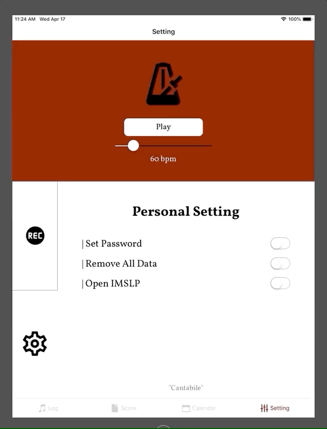

# Cantabile

iPad application for music students to read music sheets, manage daily schedules and practice hours

https://expo.io/@minha/Cantabile

## Demo

`Practice log`

`Score`

`Calendar`

`Setting`

## Features

- Screens

  1. Practice log
  2. Score
  3. Calendar
  4. Setting

- MVP features

  - Calendar schedule add form
  - Calendar schedule edit / delete
  - Score list rendering
  - Metronome
  - Timer
  - Daily to do list
  - Recorder

- Final version features
  - MVP features
  - Recorder
  - App lock screen
  - Clear app data functionality

## Technologies

- React Native
- react-native-calendars, rn-pdf-reader-js
- Expo

## Credits

- Font : Vollkorn (regular, bold), Casual
- Icon : Expo vector-icons
